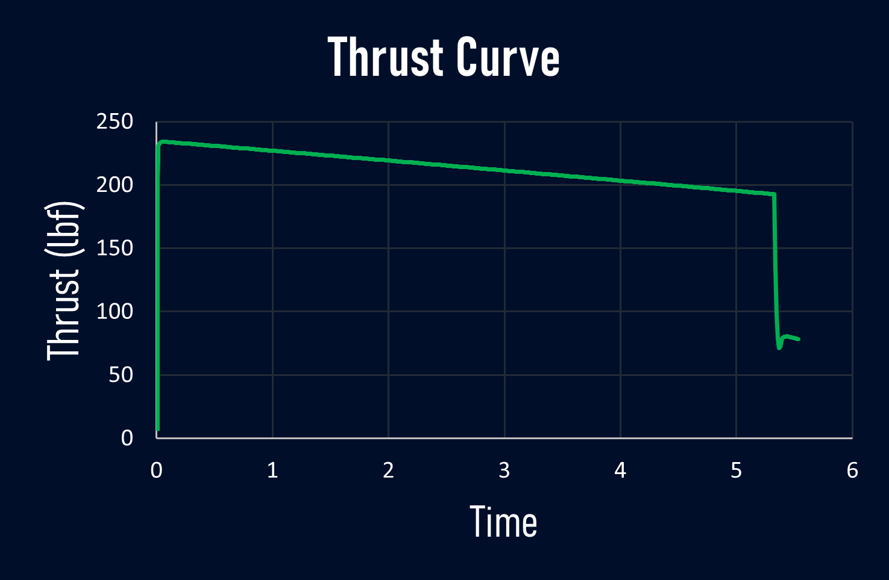
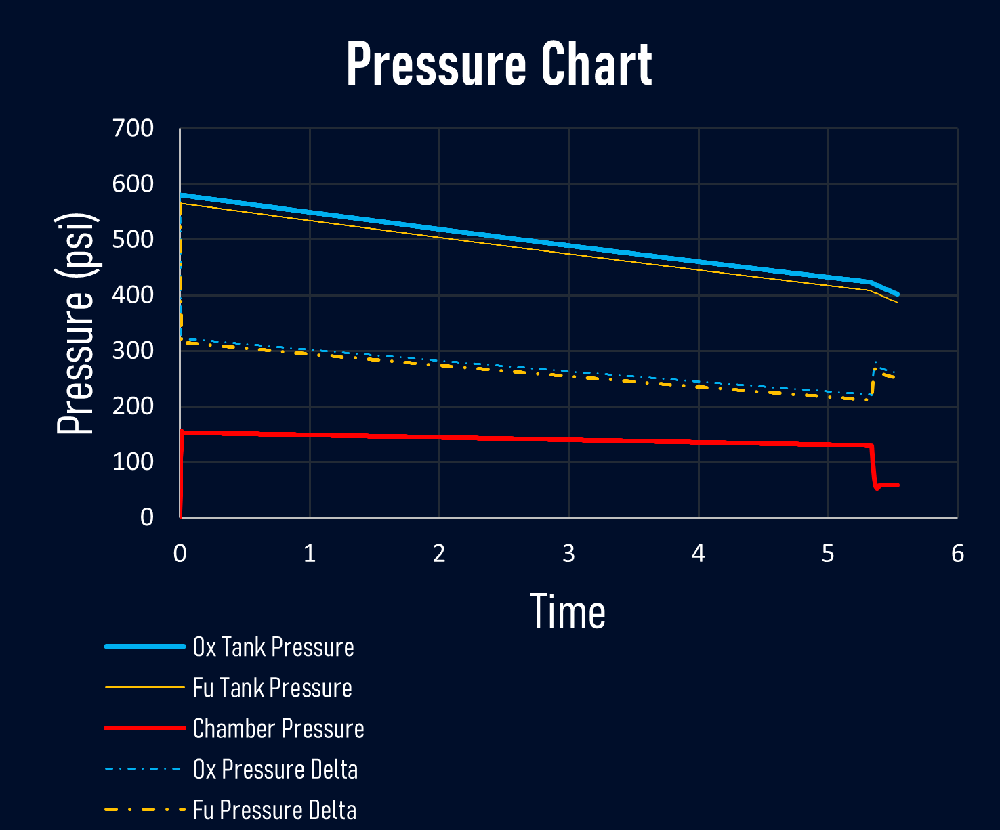
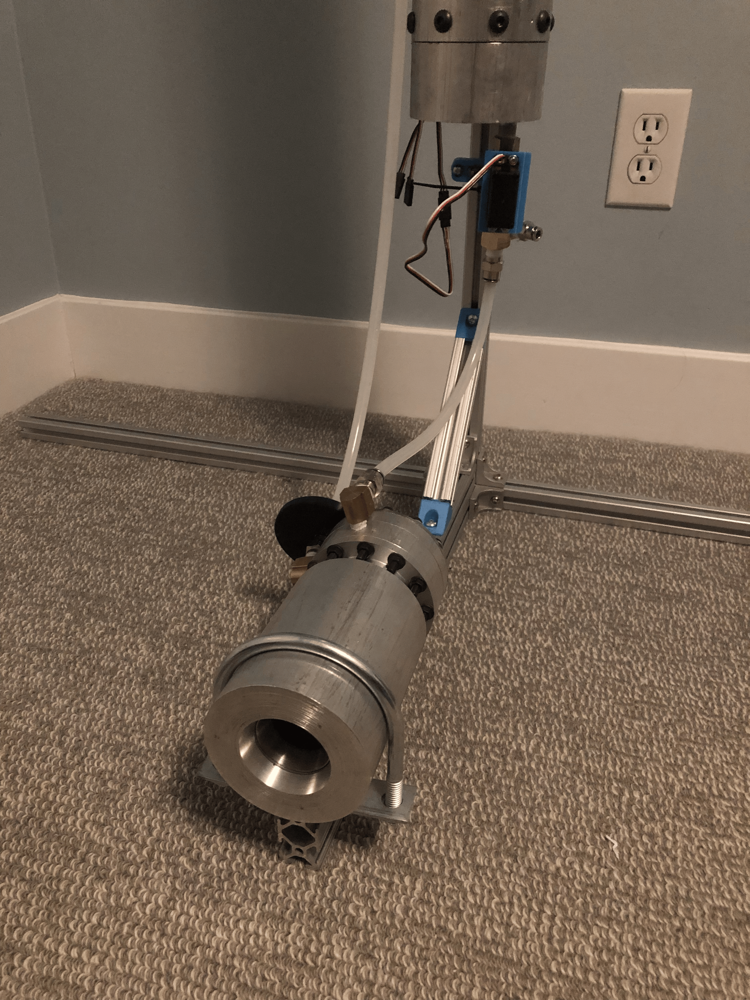

## Overview
Beginning on August of 2025, I have designed and built a nitrous-isopropanol pressure fed and pintle injected rocket motor and corrosponding test stand. Below are some images of the setup, and brief descriptions. I will be updating this site with results from the hotfire when it has been completed. Below are idealized pressure and thrust charts, as well as images of the test stand and motor. Simulations were done using Half-Cat Rocketry's public spreadsheet and NASA's CEARUN.
## Images

These are the ideal performance metrics as calculated by Half-Cat's spreadsheet-based simulator. Motor geometry and flow rates have been verified as viable via Nasa's CEARUN software.

The overall setup has been kept as simple as possible. The motor is fead by a stacked tank arrangement - isopropanol on top, nitrous on the bottom, and a piston in between. The nitrous pressurizes the whole tank. The motor itself is a heatsink design, with a 304 steel insert in the nozzle where temperatures are highest.

The control board runs off of an ESP32 developer module, and is controlled wirelessly. 

